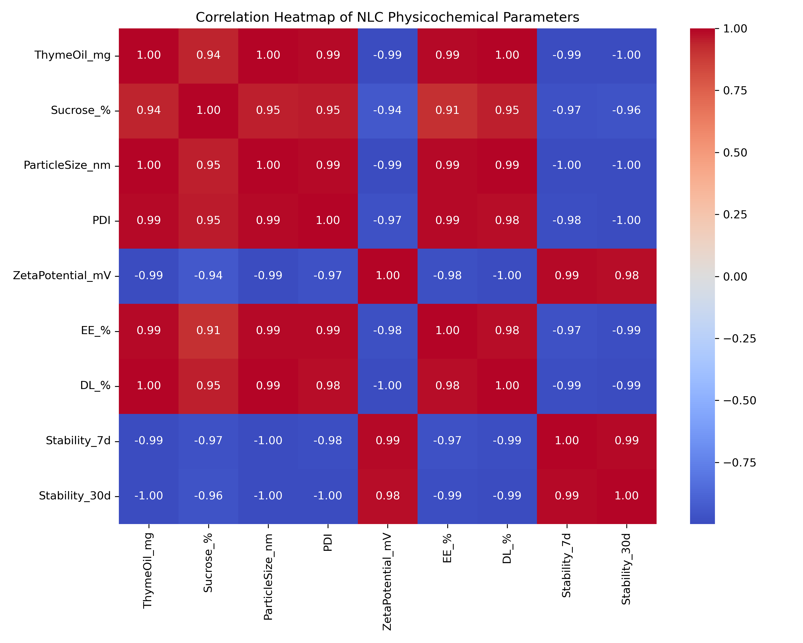
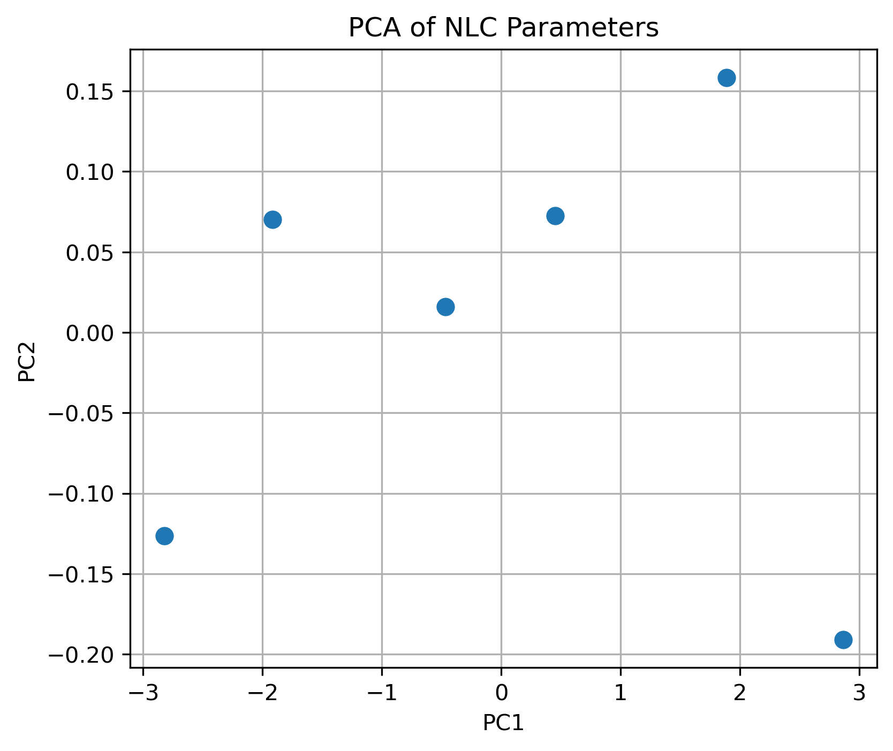

# Project 2: Nanomedicine Formulation Data Analysis
> A data-driven investigation of nanostructured lipid carrier formulations using multivariate statistical analysis to inform pharmaceutical formulation optimisation.

## Overview
This project applies data science techniques to analyse nanostructured lipid
carrier (NLC) formulation data used in pharmaceutical drug delivery.

## Methods
- Exploratory Data Analysis (EDA)
- Correlation analysis (heatmap)
- Principal Component Analysis (PCA)
- Data standardisation
## Results & Visualisations

### Correlation Heatmap

### Correlation Heatmap

The correlation heatmap reveals strong interdependencies between formulation composition, physicochemical properties, and stability outcomes. Particle size exhibits a strong inverse correlation with encapsulation efficiency and stability metrics, indicating that reduced particle size is associated with improved formulation performance.

Zeta potential shows a positive association with stability, highlighting the importance of surface charge in maintaining colloidal stability over time. These relationships emphasise the critical role of formulation optimisation in controlling nanoscale properties to enhance drug delivery performance.

### PCA Scatter Plot

### Principal Component Analysis (PCA)

Principal Component Analysis demonstrates effective dimensionality reduction of the multivariate formulation dataset. The first two principal components capture the majority of variance, enabling clear visual separation of formulations based on physicochemical behaviour.

Formulations clustering along the first principal component are primarily influenced by particle size and encapsulation efficiency, whereas separation along the second component reflects surface charge contributions. This indicates that particle size and encapsulation efficiency act as dominant drivers of formulation performance, while zeta potential contributes independently to stability characteristics.

### PCA Loadings Plot

## Interpretation of Results
### PCA Loadings Analysis

The PCA loadings plot highlights the relative contribution of individual formulation parameters to principal components. Encapsulation efficiency loads strongly along PC1, opposing particle size, suggesting an inverse relationship between these parameters. Zeta potential loads predominantly along PC2, supporting its independent role in governing formulation stability.

These findings demonstrate that optimisation of nanomedicine formulations requires simultaneous control of particle size and surface charge to achieve balanced encapsulation efficiency and long-term stability.

The correlation heatmap demonstrates strong interdependence between formulation composition and physicochemical stability. Encapsulation efficiency (EE%) shows a strong association with lipid composition and zeta potential, indicating the importance of surface charge in formulation stability.

Principal Component Analysis (PCA) reveals clear separation of formulations along PC1, primarily driven by particle size, encapsulation efficiency, and zeta potential. PC2 captures secondary variability related to formulation stability over time. These findings highlight key formulation parameters that can be optimised to enhance nanocarrier performance.

## Tools
Python, pandas, seaborn, scikit-learn, matplotlib

## Outcome
Identified key physicochemical parameters influencing formulation stability
and encapsulation efficiency.
## Pharmaceutical Relevance

Nanostructured lipid carriers are widely investigated for pulmonary and systemic drug delivery due to their ability to enhance drug stability, bioavailability, and controlled release. The analytical framework applied in this project mirrors early-stage pharmaceutical formulation screening, where multivariate analysis is used to identify critical quality attributes (CQAs).

The integration of correlation analysis and PCA provides a data-driven approach to formulation optimisation, supporting rational decision-making during preclinical development. Such methodologies are directly applicable to industrial pharmaceutical R&D pipelines focused on accelerating formulation development and improving translational outcomes.
## Key Insights for Formulation Optimisation

- Particle size is a dominant determinant of encapsulation efficiency and stability, reinforcing the need for tight control during formulation development.
- Zeta potential contributes independently to stability, underscoring the importance of surface engineering in nanocarrier design.
- Multivariate statistical techniques enable rapid identification of critical formulation parameters, reducing experimental iteration and development time.
- The combined use of correlation analysis and PCA provides a robust framework for early-stage formulation screening and optimisation.

## Author
Dr Ali Ahmad
